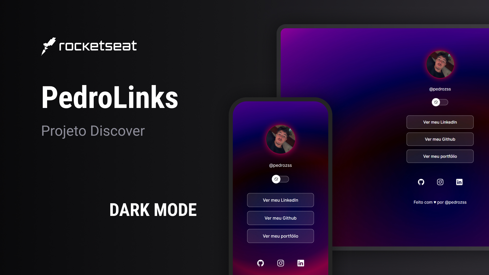
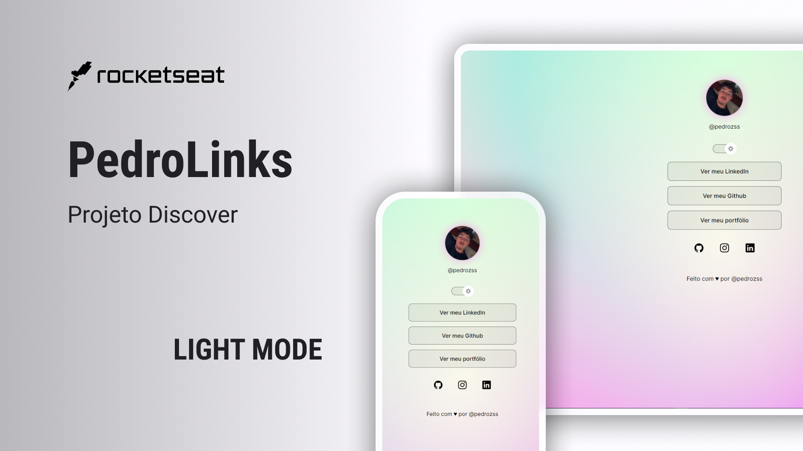

<h1 align="center"> PedroLinks </h1>

  <a href="#-tecnologias">Tecnologias</a>&nbsp;&nbsp;&nbsp;|&nbsp;&nbsp;&nbsp;
  <a href="#-projeto">Projeto</a>&nbsp;&nbsp;&nbsp;|&nbsp;&nbsp;&nbsp;

## 🌙 DarkMode

  

## ☀️ LightMode

  

## 🚀 Tecnologias

Esse projeto foi desenvolvido com as seguintes tecnologias:

- HTML e CSS
- JavaScript
- Git e Github
- Figma

## 💻 Projeto
O projeto é um agregador de links para usar como cartão de visitas online.

Peguei como base o projeto do discover da RocketSeat e fui modificando conforme o meu gosto, alterando background e adicionando algumas animações.

- [Acesse o projeto finalizado, online]

